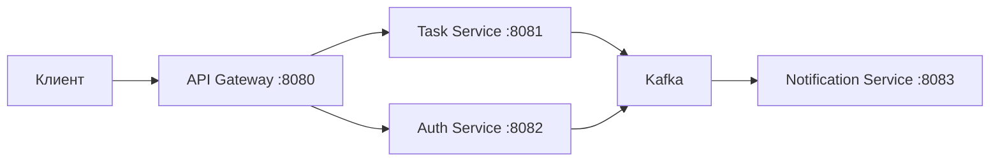

# TaskTracker

Микросервисный трекер задач с асинхронным уведомлением через Kafka.

## Технологии

- Java 21, Spring Boot 4.0.7
- Spring Cloud Gateway
- PostgreSQL, Kafka
- Docker, Docker Compose

## Архитектура



## Сервисы

| Сервис               | Порт | Описание                                                 |
|----------------------|------|----------------------------------------------------------|
| API Gateway          | 8080 | Маршрутизация, JWT-фильтр                                |
| Auth Service         | 8082 | Регистрация, логин, JWT + продюсер событий регистрации   |
| Task Service         | 8081 | CRUD задач, Kafka-продюсер, консюмер событий регистрации |
| Notification Service | 8083 | Kafka-консюмер, email-уведомления                        |

## Kafka-топики и события

| Топик                    | Продюсер     | Консюмер             | Формат                                                   |
|--------------------------|--------------|----------------------|----------------------------------------------------------|
| `user-registered-events` | Auth Service | Task Service         | `{ userId, username, email, firstName, lastName, role }` |
| `task-events`            | Task Service | Notification Service | `{ eventType, taskId, title, userEmail, ... }`           |
| `task-overdue-events`    | Task Service | Notification Service | `{ taskId, title, userEmail, deadline }`                 |

## Схема данных (основные сущности)

- **User** (Auth DB): id, username, email, password, role_id
- **Task** (Task DB): id, title, description, deadline, status_id, task_type_id
- **Participant** (Task DB): связь Task ↔ Person / Organisation с ролью

## Запуск

```bash
docker-compose up -d
```

## Документация API

Swagger: http://localhost:8080/swagger-ui/index.html

## Переменные окружения

- `JWT_SECRET` — ключ для подписи JWT